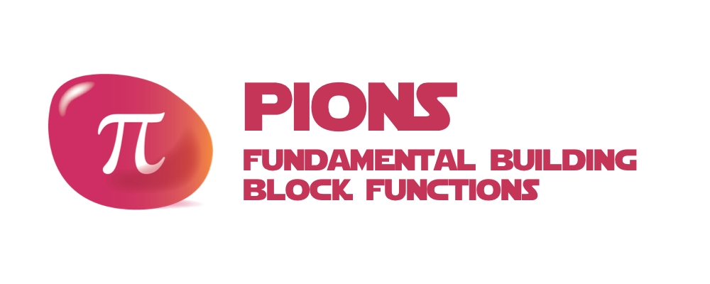

# pions



> **THIS PROJECT IS STILL IN THE DESIGN PHASE**
>
> IDEAS & CONTRIBUTIONS ARE WELCOME
>
> An [Open Source Universe](https://github.com/intellibus/approach) Project

---

## Contents

- [pions](#pions)
  - [Contents](#contents)
  - [Features ✨](#features-)
  - [Install 🛠](#install-)
  - [Usage 🔭](#usage-)
  - [Documentation 🛰](#documentation-)
  - [Contributing 🌎](#contributing-)
  - [License ⚖️](#license-️)

## Features ✨

- Mapping Functions `Planned`
- Aggregation Functions `Planned`
- Reduce Functions `Planned`
- Typescript Support `Planned`

## Install 🛠

```sh
npm install pions
```

## Usage 🔭

Read more about the [Design](https://github.com/intellibus/pions/blob/main/DESIGN.md) behind `pions` here.

```typescript
import { mapKeysForValues } from 'pions';

const data = {
  'Group 1': [1,2,3,4,...],
  'Group 2': [1,1,2,3,...],
  'Group 3': [1,4,9,16,...],
}

const counts = mapKeysForValues(data, ({ value }) => value.length)

// { 'Group 1': 50, 'Group 2': 15, 'Group 3': 32 }
```

## Documentation 🛰

`pions` *is under active development, documentation will be added once an initial release is ready.*

## Contributing 🌎

We would love for you to contribute your ideas, code, & fixes to `pions`.

We encourage everyone to read our [Design Document](https://github.com/intellibus/pions/blob/main/DESIGN.md) to learn more about the thought process behind pions.

Also check out the [rewards](https://github.com/intellibus/approach/blob/main/REWARDS.md) offered for contributing to the [Open Source Universe](https://github.com/intellibus/approach).

## License ⚖️

MIT
